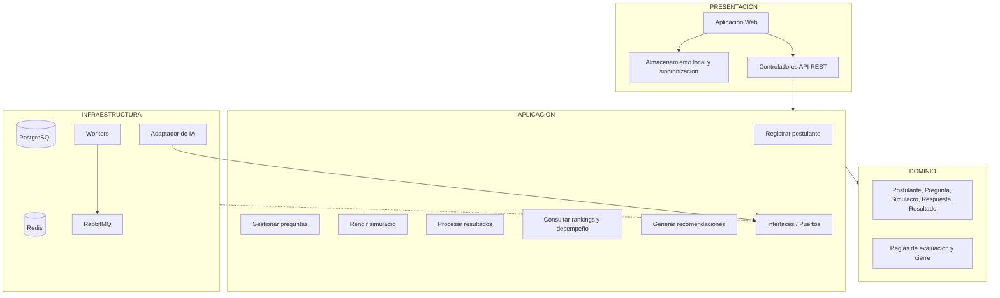

# Enfoque arquitectónico: Clean Architecture

## 1. Enfoque arquitectónico seleccionado

Para el sistema de simulacros de exámenes virtuales con inteligencia artificial de la Academia Sofía, se selecciona el enfoque **Clean Architecture**.

Este enfoque permite separar las reglas del negocio de los detalles tecnológicos, facilitando el mantenimiento, las pruebas y la incorporación de nuevas funcionalidades.

Se aplicará dentro del monolito modular definido en el estilo arquitectónico, manteniendo el procesamiento asíncrono mediante workers y el servicio de inteligencia artificial independiente.

## 2. Justificación del enfoque

La elección de Clean Architecture responde principalmente al driver DA10 – Mantenibilidad y a la decisión ADR-002.

Permite organizar el sistema en capas con responsabilidades definidas, evitando que las reglas del negocio dependan directamente de tecnologías como Redis, PostgreSQL, RabbitMQ o servicios externos de inteligencia artificial.

También facilita modificar componentes tecnológicos sin afectar las reglas principales de los simulacros.

## 3. Capas de Clean Architecture

### 3.1. Dominio

Contiene las entidades y reglas principales del negocio, independientes de frameworks y bases de datos.

Elementos principales:

- Postulante.
- Pregunta.
- Simulacro.
- Respuesta.
- Resultado.
- Reglas de cálculo de puntajes.
- Reglas de tiempo y cierre del examen.

### 3.2. Aplicación

Contiene los casos de uso que coordinan las operaciones del sistema.

Casos de uso principales:

- Registrar postulante y generar credenciales.
- Gestionar banco de preguntas.
- Iniciar y rendir simulacro.
- Registrar y sincronizar respuestas.
- Finalizar examen y calcular puntaje.
- Consultar resultados y rankings.
- Consultar historial y desempeño académico.
- Generar recomendaciones de refuerzo académico.

Esta capa define interfaces para acceder a la persistencia y comunicarse con servicios externos, sin depender directamente de sus implementaciones.

### 3.3. Presentación

Permite la interacción entre los usuarios y el sistema.

Componentes principales:

- Aplicación web para postulantes, docentes y administradores.
- Controladores de API REST.
- Validación de solicitudes.
- Visualización de notas, rankings y gráficos.
- Interfaz para rendir simulacros y registrar respuestas.

El cliente web incorpora almacenamiento local y sincronización de respuestas para soportar conectividad intermitente.

### 3.4. Infraestructura

Contiene las implementaciones tecnológicas utilizadas por los casos de uso.

Componentes principales:

- PostgreSQL para almacenamiento definitivo.
- Redis para respuestas temporales y fichas activas.
- RabbitMQ para mensajería asíncrona.
- Workers para procesamiento de puntajes y rankings.
- Adaptador para el servicio independiente de IA.
- Implementaciones de repositorios.
- Autenticación y mecanismos de cifrado.

Docker y Kubernetes se utilizan para desplegar y escalar los componentes del sistema.

## 4. Diagrama de Clean Architecture

## 5. Regla de dependencias

En Clean Architecture, las dependencias del código deben apuntar hacia las capas internas.

- La capa de Dominio no depende de las demás capas.
- La capa de Aplicación depende del Dominio.
- La capa de Presentación utiliza los casos de uso de Aplicación.
- La capa de Infraestructura implementa las interfaces definidas por Aplicación.

Las tecnologías externas se conectan mediante adaptadores, evitando que las reglas del negocio dependan directamente de ellas.

## 6. Relación con las decisiones arquitectónicas

| Decisión | Aplicación del enfoque |
|---|---|
| ADR-001 – Monolito modular | Clean Architecture organiza las responsabilidades internas de los módulos. |
| ADR-002 – Clean Architecture | Separa Dominio, Aplicación, Presentación e Infraestructura. |
| ADR-003 – Redis | Implementación de almacenamiento temporal mediante adaptadores. |
| ADR-004 – RabbitMQ | Mensajería asíncrona mediante interfaces y adaptadores. |
| ADR-006 – Offline-first | Almacenamiento local y sincronización desde la presentación web. |
| ADR-007 – Seguridad | Autenticación y autorización integradas mediante interfaces y mecanismos de infraestructura. |
| ADR-008 – API REST | Controladores de presentación que invocan los casos de uso. |

## 7. Conclusión

Clean Architecture permite organizar el sistema de simulacros virtuales de la Academia Sofía en capas independientes, facilitando su mantenimiento y evolución.

El enfoque protege las reglas del negocio frente a cambios tecnológicos y permite integrar PostgreSQL, Redis, RabbitMQ y el servicio de inteligencia artificial sin acoplar directamente estas tecnologías al núcleo del sistema.
