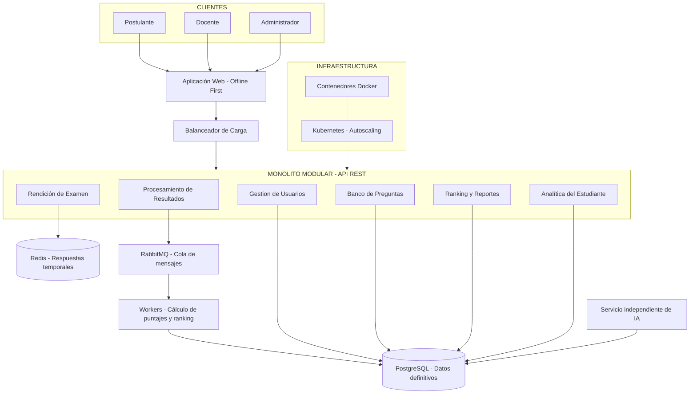

# Estilo arquitectónico

## 1. Estilo arquitectónico seleccionado

Para el sistema de simulacros de exámenes virtuales con inteligencia artificial de la Academia Sofía, se selecciona el estilo arquitectónico de **Monolito Modular con Procesamiento Asíncrono y Servicio de IA Independiente**.

Este estilo permite organizar las funcionalidades principales del sistema en módulos separados dentro de una misma aplicación backend, facilitando su mantenimiento y evolución.

El procesamiento de resultados y rankings se realiza mediante colas de mensajes y workers, mientras que el servicio de inteligencia artificial funciona de manera independiente sobre los resultados consolidados.

## 2. Justificación del estilo arquitectónico

La elección del estilo arquitectónico responde a los siguientes drivers:

| Driver | Justificación |
|---|---|
| DA01 – Escalabilidad | Permite desplegar varias instancias del backend para atender hasta 5,000 postulantes simultáneos. |
| DA02 – Rendimiento | Redis reduce la carga de almacenamiento durante la rendición de exámenes. |
| DA03 – Disponibilidad | El balanceador de carga distribuye las solicitudes entre las instancias disponibles. |
| DA06 – Eficiencia de costos | Kubernetes permite ajustar la cantidad de instancias según la demanda. |
| DA07 – Procesamiento asíncrono | RabbitMQ y los workers permiten procesar resultados y rankings sin bloquear el sistema. |
| DA10 – Mantenibilidad | La separación por módulos facilita incorporar nuevas funcionalidades sin modificar todo el sistema. |

## 3. Módulos principales

El backend se organiza en los siguientes módulos:

- **Gestión de Usuarios:** permite al administrador registrar postulantes, generar automáticamente sus credenciales de acceso y gestionar los roles y permisos del sistema. No incluye procesos de matrícula ni pagos. 
- **Banco de Preguntas:** gestiona las preguntas y los exámenes.
- **Rendición de Examen:** controla el desarrollo del simulacro y el registro de respuestas.
- **Procesamiento de Resultados:** coordina el cálculo de puntajes mediante workers.
- **Ranking y Reportes:** genera rankings generales, por carrera y por sede.
- **Analítica del Estudiante:** permite consultar el rendimiento académico y su evolución.

El servicio de inteligencia artificial se mantiene independiente para identificar cursos débiles y generar recomendaciones personalizadas de refuerzo académico.

## 4. Diagrama del estilo arquitectónico

## 5. Relación con las decisiones arquitectónicas

| Decisión | Aplicación en el estilo |
|---|---|
| ADR-001 – Monolito modular | Organización del backend en módulos funcionales. |
| ADR-003 – Redis | Almacenamiento temporal de respuestas activas. |
| ADR-004 – RabbitMQ | Procesamiento asíncrono mediante workers. |
| ADR-005 – Kubernetes | Escalamiento automático de las instancias del backend. |
| ADR-006 – Offline-first | Conservación local y sincronización de respuestas desde el cliente. |
| ADR-008 – API REST | Comunicación entre la aplicación web y el backend. |

## 6. Conclusión

El monolito modular con procesamiento asíncrono permite organizar las funcionalidades de la Academia Sofía en componentes mantenibles, mientras que Redis, RabbitMQ y Kubernetes contribuyen a responder a las necesidades de rendimiento, disponibilidad y escalabilidad.

El servicio de inteligencia artificial independiente permite generar recomendaciones académicas sin interferir directamente con la rendición de los exámenes.
